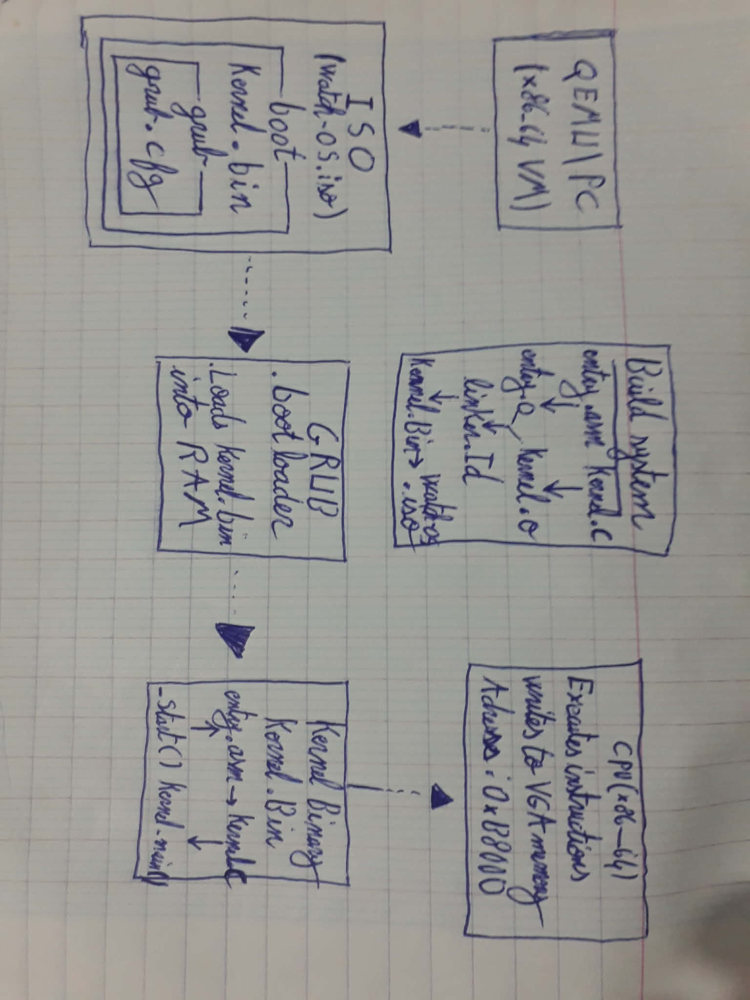
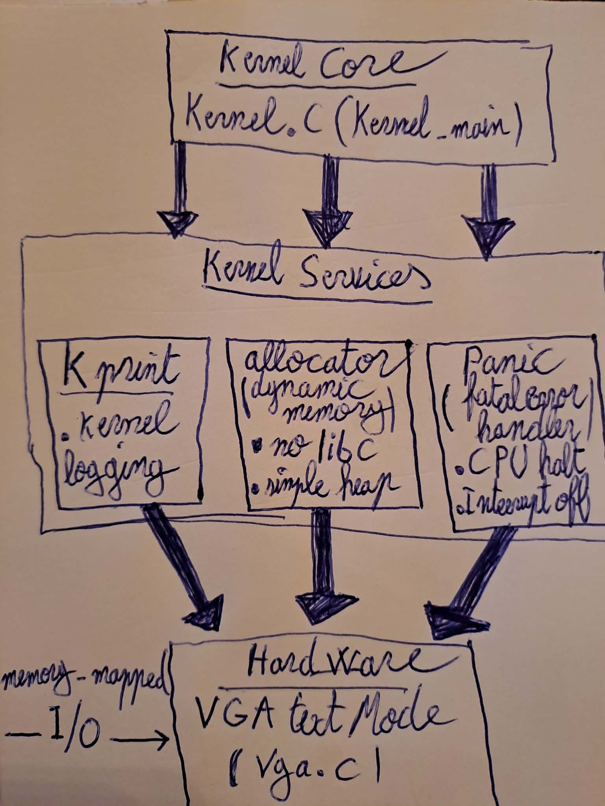

# x86_64 Operating System

A **from-scratch educational operating system** built to deeply understand how a computer boots, how a kernel is built and loaded, and how low-level hardware (CPU, memory, VGA) is accessed directly.

This project is **not a production OS**. It is a **learning-focused kernel** designed to answer questions like:

- What really happens between power-on and `kernel_main()`?
- Why do object files, linkers, ISOs, and bootloaders exist?
- How does text appear on the screen without an OS?
- Why do we need GRUB if we already have assembly code?

---

## 🎯 Project Goals

- Understand the **entire boot chain** (Firmware → Bootloader → Kernel)
- Build a **freestanding x86_64 kernel**
- Learn **linking, memory layout, and binary formats**
- Write directly to **VGA text mode** (no libraries, no OS)
- Run the system inside **QEMU**

---

## 🧱 Project Structure

```text
.
├── boot/
│   └── boot.asm        # Assembly entry point (low-level setup)
├── kernel/
│   └── kernel.c        # C kernel code (kernel_main)
├── linker.ld           # Linker script (memory layout)
├── grub/
│   └── grub.cfg        # GRUB configuration
├── build/
│   ├── boot.o
│   ├── kernel.o
│   ├── kernel.bin
│   └── os.iso
└── README.md
```

---

# Phase 0 – Environment Setup

This project assumes a **Linux environment** (native Linux or WSL). Commands below are for **Ubuntu / Debian-based systems**.

---

## 1️⃣ Required Tools

### Install build essentials

```bash
sudo apt update
sudo apt install -y build-essential
```

### Install NASM (Assembler)

```bash
sudo apt install -y nasm
```

### Install GRUB utilities

```bash
sudo apt install -y grub-pc-bin grub-common xorriso
```

### Install QEMU (x86_64 emulator)

```bash
sudo apt install -y qemu-system-x86
```

---

## 2️⃣ Toolchain Assumptions

- Architecture: **x86_64**
- Binary format: **ELF → flat binary**
- Compiler: `gcc` (freestanding, no libc)
- Linker: `ld`

No standard library is used.

---

# Phase 1 – Architecture & Boot Process
<p align="center">
  
</p>

> This phase explains **why every component exists**, **the order of execution**, and **how control flows from power-on to the kernel**.

The diagram below represents the **full boot pipeline** used in this project.

---

## 🖥️ High-Level Overview

```text
Power On
  ↓
Firmware (BIOS / UEFI)
  ↓
Bootloader (GRUB)
  ↓
Kernel Binary (kernel.bin)
  ↓
Assembly Entry (_start)
  ↓
C Kernel (kernel_main)
```

Each stage exists because **the CPU cannot jump directly to C code** and **cannot understand filesystems, ISOs, or ELF by itself**.

---

## 📦 Build System (Right Side of Diagram)

### Step 1: Source Code

- `boot.asm` → low-level CPU setup
- `kernel.c` → main kernel logic

The CPU **cannot execute C directly**. Everything must become **machine code**.

---

### Step 2: Compilation & Assembly

```text
boot.asm   → boot.o
kernel.c  → kernel.o
```

- `.o` files are **object files**
- They contain machine code but:
  - Not placed at final memory addresses
  - Not executable alone

This separation allows **modular builds**.

---

### Step 3: Linking (linker.ld)

```text
boot.o + kernel.o → kernel.bin
```

The **linker**:

- Decides **where each section lives in memory**
- Resolves symbols (`_start`, `kernel_main`)
- Produces a **single flat binary**

This step is **mandatory** because CPUs execute memory, not files.

---

## 💿 ISO Creation (Top of Diagram)

```text
os.iso
└── boot/
    ├── grub/
    │   └── grub.cfg
    └── kernel.bin
```

### Why an ISO?

- QEMU boots **firmware**, not raw binaries
- Firmware understands **bootable media** (ISO, disk)
- ISO acts like a virtual CD-ROM

---

## 🧭 GRUB – Why It Exists

### "I already have boot.asm, why GRUB?"

Because:

- Firmware **cannot load arbitrary binaries**
- Firmware **does not know your kernel format**
- Firmware **does not set up protected/long mode safely**

GRUB solves all of this.

---

## 🧠 Kernel Execution Flow

### 1️⃣ CPU jumps to `_start`

- Entry point defined in `linker.ld`
- Written in assembly

Responsibilities:

- Set stack pointer
- Clear registers if needed
- Call `kernel_main`

---

### 2️⃣ `kernel_main()` (C code)

At this point:

- CPU is in 64-bit mode
- Paging is enabled
- Stack is valid

Now you are officially **inside your OS**.

---

## 🖥️ VGA Text Mode – How Output Works

### VGA Memory

```text
Address: 0xB8000
```

- Each character cell = 2 bytes
  - Byte 1: ASCII character
  - Byte 2: Color attribute

Writing to this memory **is writing to the screen**.
---

# Phase 2 – Kernel Core Services
<p align="center">
  
</p>

This phase transforms the kernel from a "booting program" into a structured, debuggable system by introducing core services required by all real operating systems.

## 🎯 Phase Goals

- Learn kernel modularity and clean abstraction layers
- Implement hardware interaction without BIOS help
- Build dynamic memory management from scratch
- Handle fatal errors gracefully (no undefined behavior)

---

## 🏗️ Architecture Overview

```text
kernel_main()
     |
     v
+------------------+
| Kernel Core      |
| (kernel.c)       |
+------------------+
     |
     v
+-----------------------------+
| Kernel Services Layer       |
|-----------------------------|
| kprint   panic   allocator  |
+-----------------------------+
     |
     v
+------------------+
| Hardware Layer   |
| VGA Text Mode    |
| (vga.c)          |
+------------------+
```

The key principle: Higher layers should not know hardware details. If you change VGA to serial output, only vga.c should change.

---

## 🧩 Kernel Subsystems

### 🖥️ VGA Driver (vga.c / vga.h)

**What it does:**
- Writes characters directly to VGA memory (0xB8000)
- Manages cursor position and color attributes
- Initializes the 80×25 text mode

**Why it exists:**
- After boot, BIOS services disappear
- The kernel must talk to hardware directly
- This is the lowest-level output layer, hardware-specific

---

### 📝 Kernel Print System (kprint.c / kprint.h)

**What it does:**
- Provides a clean printing interface to the kernel
- Hides VGA details behind simple functions

**Example:**
```c
kprint("Kernel initialized\n");
kprint("Memory: %d MB available\n", total_memory);
```

**Why it exists:**
- Prevents duplicated VGA code everywhere
- Centralizes output behavior
- Acts as the kernel's logging interface

---

### 💥 Panic System (panic.c / panic.h)

**What it does:**
- Handles unrecoverable kernel errors
- Displays clear error messages
- Safely halts the CPU

**Example:**
```c
if (memory == NULL) {
    panic("Out of memory at line %d", __LINE__);
}
```

**Behavior:**
- Prints error message with optional formatting
- Disables interrupts to prevent further damage
- Halts the system permanently

This is your kernel crash screen

---

### 🧠 Dynamic Memory Allocation (allocator.c / allocator.h)

**What it does:**
- Provides kmalloc() and kfree() equivalents
- Enables dynamic data structures in the kernel
- Uses a simple linear (bump) allocator

**Characteristics:**
- No libc dependencies
- No system calls (we are the kernel!)
- Simple, educational design (not optimized for production)

**Why it exists:**
- Real kernels need dynamic memory
- Static arrays won't scale for complex features
- Memory management is required for interrupts, paging, scheduling

---

## 🔁 Execution Flow

### Normal Boot:
```text
kernel_main()
  ├── vga_init()                    # Setup display hardware
  ├── kprint("Booting kernel...")   # First visible output
  ├── allocator_init()              # Initialize heap memory
  ├── kprint("Heap ready at 0x%x")  # Confirm setup
  └── Continue to main kernel logic
```

### Error Handling:
```text
Fatal error detected
     |
     v
panic("Something went wrong")
     |
     v
+---------------------------+
| 1. Print error message    |
| 2. Disable interrupts     |
| 3. Halt CPU (hlt)         |
+---------------------------+
```

---

## 🧠 What This Phase Teaches

**Core Concepts:**
- **Kernel modularity:** Clean separation between hardware and logic
- **Hardware abstraction:** Hiding messy hardware details behind clean APIs
- **Bare-metal memory management:** Allocating memory without an OS to help
- **Controlled failure:** Making crashes debuggable instead of mysterious

---

# Phase 3 – Interrupts & Exceptions (🚧 Planned)

- IDT setup
- CPU exceptions
- Keyboard interrupt

---

# Phase 4 – Memory Management (🚧 Planned)

- Paging
- Physical memory manager
- Heap

---

# Phase 5 – Advanced Features (🚧 Planned)

- Timer
- Multitasking
- User mode

---

## 🧪 Running the OS

```bash
qemu-system-x86_64 -cdrom build/os.iso
```

---

## 📚 Learning Philosophy

This project intentionally avoids shortcuts.

Every file exists to answer **"why"**, not just **"how"**.

---

## 🧑‍💻 Author

**Mohamed Rayen Ouerghui**  
IT Engineering Student – Low-Level Systems & OS Internals

---

🔥 If you understand this project, you understand how *every OS on Earth* starts.

